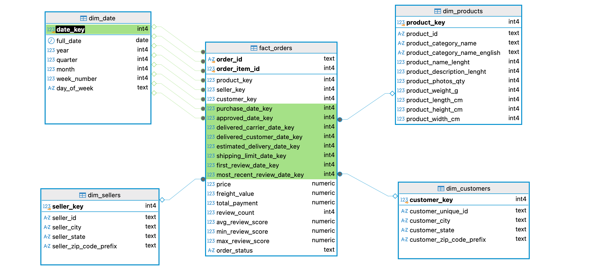

# Ecommerce Dimensional Model

A data engineering portfolio project: building a star schema data
warehouse from a real, messy public e-commerce dataset — practicing SQL
joins, subqueries, window functions, and CTEs through dimensional
modeling and hands-on data quality investigation.

## Project Goal

Built to close a specific skill gap: hands-on fluency with SQL joins,
subqueries, window functions, and CTEs — identified as weak after an
earlier checkpoint project. Dimensional modeling itself is also a core,
job-relevant skill for the data engineer role this project supports, so
the two goals are combined deliberately rather than treated as separate
exercises.

## Skills Demonstrated

- **SQL:** joins, subqueries, window functions, CTEs, dimensional
  modeling (star schema design)
- **Python / pandas:** data exploration, profiling, and validation at
  scale (from a few hundred rows to over 1 million)
- **Data quality investigation:** systematic anomaly detection using
  aggregation, regex pattern matching, string similarity, and
  cross-column/cross-file consistency checks
- **Pipeline design:** ELT architecture (Python extract/load, SQL
  transform) — the same pattern dbt is built around
- **Tooling:** PostgreSQL, DBeaver, git/GitHub, VSCode

## Project Overview

The pipeline: explore all 9 raw CSVs to understand their real structure
and quality, load them as-is into Postgres staging tables, then
transform them into a star schema entirely in SQL — deduping, cleaning,
and joining along the way. The project closes with a set of checkpoint
SQL queries demonstrating the specific skills it was built to practice.

## Dataset

**Brazilian E-Commerce Public Dataset by Olist**
https://www.kaggle.com/datasets/olistbr/brazilian-ecommerce

Real, anonymized data covering ~100,000 orders placed on the Olist
marketplace (2016-2018), split across 9 CSVs joined by shared keys
(`order_id`, `customer_id`, `product_id`, `seller_id`):

| File | Contents |
|---|---|
| `olist_orders_dataset.csv` | One row per order: status, purchase/delivery timestamps |
| `olist_order_items_dataset.csv` | Line items per order: product, seller, price, freight value |
| `olist_order_payments_dataset.csv` | Payment method, installments, payment value per order |
| `olist_order_reviews_dataset.csv` | Customer review score, comment, review timestamps |
| `olist_customers_dataset.csv` | Customer ID, city, state, zip prefix |
| `olist_sellers_dataset.csv` | Seller ID, city, state, zip prefix |
| `olist_products_dataset.csv` | Product category, dimensions, weight |
| `olist_geolocation_dataset.csv` | Zip code prefix to lat/long mapping (~1M rows) |
| `product_category_name_translation.csv` | Portuguese to English category name mapping |

CSVs are not committed to this repo (see `.gitignore`) — download them
from the Kaggle link above into `raw_csv/` to reproduce.

## Pipeline Pattern: ELT, not ETL

- **Extract:** Python reads the 9 raw CSVs.
- **Load:** Python loads them into Postgres staging tables (`stg_*`)
  largely as-is — only load-hygiene fixes (dtypes, encoding), no
  business logic.
- **Transform:** SQL against the staging tables builds the star schema
  — deduping, null handling, standardization, and joins all happen
  here.

Chosen deliberately over ETL to force SQL joins/CTEs/window functions,
and because it mirrors the dbt-style pattern used in real-world DE
pipelines.

## Notable Data Quality Findings

Full investigation documented in `notes/data_exploration.md`. A few
highlights:

- **Root-caused a timezone artifact to the exact source:** 85 anomalous
  timestamps in the reviews data all traced to two specific historical
  Brazilian daylight-saving-time transition dates (2016-10-16 and
  2017-10-15), not random bad data.
- **Uncovered systemic data entry issues in seller location data:**
  across 34 zip codes, found city fields containing email addresses,
  full state names, raw zip-code numbers, and a wide range of
  misspellings/concatenation errors — catalogued and exported for
  future cleaning.
- **Quantified hidden duplication in a 1M-row geolocation table:**
  confirmed ~25% of apparent city-name variety was accent-mark and
  casing noise (e.g. "sao paulo" vs "são paulo"), not real distinct
  values, using Unicode normalization.
- **Caught and corrected my own faulty hypothesis before it became a
  schema decision:** initially assumed two near-duplicate product
  categories were the reason a translation table had fewer entries
  than the products table — verified with a direct set comparison and
  found the real cause was two entirely different, unrelated missing
  categories.
- **Distinguished two different causes of "multiple rows per order"**
  in payment data (mixed payment methods vs. multiple entries of the
  same method) by pulling and comparing real examples rather than
  assuming from aggregate counts alone.

## Target Schema

- `fact_orders` — grain: order line item level
- `dim_customers`
- `dim_products`
- `dim_sellers`
- `dim_geolocation`
- `dim_date`



`fact_orders` sits at the center, with foreign keys to `dim_products`,
`dim_sellers`, and `dim_customers`. `dim_date` is a **role-playing
dimension** — referenced 8 separate times (highlighted above) to
capture 8 distinct date facts per order line item (purchase, approval,
carrier handoff, customer delivery, estimated delivery, shipping
deadline, first review, most recent review) from a single calendar
table, rather than duplicating date attributes across 8 columns.

## Key Findings

Results from the three checkpoint queries against the finished star
schema (see `sql/checkpoint1_*.sql` through `checkpoint3_*.sql`):

- **Top sellers are heavily concentrated in São Paulo state.** 9 of
  the top 10 sellers by total revenue are based in SP; the single
  highest-revenue seller (Guariba, SP) generated $229,472.63 across
  the dataset.
- **Order volume grew sharply through the platform's first year.**
  From 3 orders in September 2016 (the earliest month in this
  dataset) to over 3,600/month by mid-2017 — a pattern consistent
  with a marketplace scaling up rapidly, not steady-state demand.
- **The average order value across the whole dataset is $137.75.**
  Customers whose average order value exceeds that figure skew
  heavily toward one-time, high-value purchases rather than frequent
  smaller ones — most qualifying customers placed exactly one order,
  with the single highest average order value reaching $13,440.

## Tech Stack

Python 3.12 (pandas, SQLAlchemy, psycopg2), PostgreSQL, DBeaver, VSCode.

## How to Reproduce

```bash
git clone https://github.com/Hanyyoussef4/ecommerce-dimensional-model.git
cd ecommerce-dimensional-model
python3 -m venv venv
source venv/bin/activate
pip install -r requirements.txt
```

Download the dataset from the Kaggle link above into `raw_csv/`, then
run in this order:

1. `python scripts/create_database.py` — creates the `ecommerce_dw`
   Postgres database (idempotent, safe to re-run).
2. `python scripts/load_raw_to_postgres.py` — loads all 9 raw CSVs
   into Postgres staging tables (`stg_*`).
3. Load the two seed correction tables (needed before the dimensions
   that join against them):
   - `python scripts/load_seller_city_corrections.py`
   - `python scripts/seed_geolocation_city_corrections.py`
4. Run the 5 dimension builds, in any order relative to each other:
   `sql/build_dim_products.sql`, `sql/build_dim_customers.sql`,
   `sql/build_dim_sellers.sql`, `sql/build_dim_geolocation.sql`,
   `sql/build_dim_date.sql`.
5. `sql/build_fact_orders.sql` — depends on all 5 dimensions above
   plus the staging tables; run last among the schema builds.
6. `sql/add_foreign_keys.sql` — adds the 11 FK constraints; run only
   after `fact_orders` is fully built and verified.
7. (Optional) `sql/checkpoint1_top_sellers_by_revenue.sql`,
   `checkpoint2_month_over_month_trends.sql`,
   `checkpoint3_above_average_customers_subquery.sql` (or its
   `_window_function.sql` alternate) — the analytical queries, safe
   to run any time after step 6.

## Milestones

High-level summary — see [notes/BUILD_LOG.md](notes/BUILD_LOG.md) for
the full day-by-day build history, including every bug found, decision
made, and verification step.

- **2026-07-24** — Project scaffolded (git, venv, folder structure,
  GitHub repo).
- **2026-08-19** — Data exploration complete: all 9 raw CSVs profiled,
  with systematic data quality investigation documented in
  `notes/data_exploration.md`.
- **2026-08-20** — `ecommerce_dw` database created; all 9 raw CSVs
  loaded to Postgres staging tables, row counts verified exactly
  against source CSVs.
- **2026-08-29 – 2026-09-01** — Star schema fully designed: all 6
  tables (`fact_orders` + 5 dimensions), documented across 7 ADRs.
- **2026-09-05 – 2026-09-18** — All 5 dimension tables built and
  verified in SQL. Found and fixed 2 real load-hygiene bugs along the
  way — zip codes silently losing leading zeros ([ADR 0006](notes/decisions/0006-zip-code-leading-zero-fix.md)),
  and date/timestamp columns loading as `TEXT` instead of proper
  types ([ADR 0010](notes/decisions/0010-date-column-type-fix.md)) —
  each fixed at the load layer and reloaded, not patched downstream.
- **2026-09-19** — `fact_orders` built (112,650 rows, all 10 foreign
  keys resolved), 11 FK constraints added across the schema, and the
  star schema's ER diagram verified to render correctly.
- **2026-09-20** — All 3 checkpoint SQL queries written and verified
  (window functions, chained CTEs, a subquery), closing out the
  project's original skill-gap goal. **Project complete.**

## Status

- [x] Project scaffolded (venv, git, requirements.txt)
- [x] Raw CSVs explored, data quality findings documented
      (`notes/data_exploration.md`)
- [x] `ecommerce_dw` database created
- [x] Raw CSVs loaded to Postgres staging tables
- [x] Star schema designed
- [x] Dimension tables built (SQL)
- [x] Fact table built (SQL)
- [x] Checkpoint queries written (top sellers by revenue — window
      function; month-over-month order trends — CTE; above-average
      order value customers — subquery)

## Limitations & Future Work

This is a deliberate one-time batch build, not a production pipeline
— worth being explicit about what that means and doesn't mean:

- **The loader is full-refresh, not incremental.** `load_raw_to_postgres.py`
  uses `if_exists="replace"` — every run truncates and reloads all 9
  staging tables from scratch. That's the right choice for a one-time
  build, but a production version of this pipeline would need
  incremental/upsert logic (only loading new or changed rows) rather
  than a full reload every time.
- **No orchestration or scheduling.** Scripts and SQL files are run
  manually, in a specific order (see
  [How to Reproduce](#how-to-reproduce)). A production pipeline would
  use something like Airflow or dbt's own scheduling to run this
  automatically and handle failures/retries.
- **No automated tests.** Every verification in this project (row
  counts, `NULL` checks, distinct-value checks) was run manually and
  interactively while building. A production version would turn these
  into automated tests (e.g. dbt tests, or a Python test suite) that
  run on every load, not just once during development.
- **Next project, deliberately:** these gaps aren't oversights — they're
  the natural scope boundary of a project meant to practice SQL and
  dimensional modeling specifically. Building an incremental,
  orchestrated version of a pipeline like this is the intended next
  step in this portfolio.

## Good to Know

- This is real, messy public data, not a cleaned-up teaching dataset —
  every data quality issue documented in `notes/data_exploration.md`
  was genuinely discovered during exploration, not injected for
  practice.
- Olist anonymized seller/store-identifying text using Game of Thrones
  house names (per the Kaggle dataset card) — unusual values in text
  fields may reflect this rather than being errors.
- `notes/data_exploration.md` documents the full investigative process
  for each file, not just conclusions — useful context if you want to
  see the reasoning behind specific data quality findings, not just the
  final decisions.